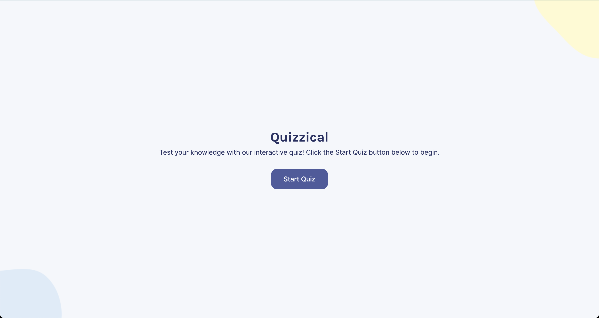
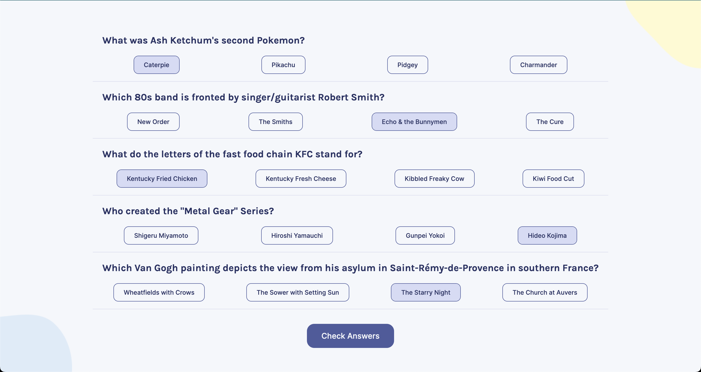
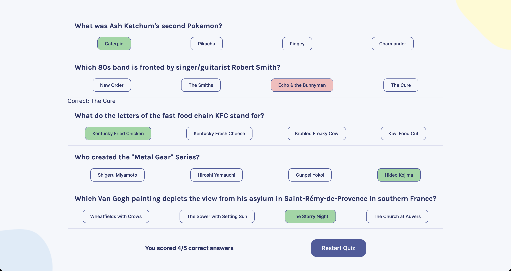

# Quizzical App

The Quiz App is a web application that allows users to take a quiz by answering multiple-choice questions. It provides an interactive user interface for answering questions, displays the results at the end, and allows users to restart the quiz.

## Features

- Fetches quiz questions from an API
- Randomizes the order of answer choices for each question
- Allows users to select an answer for each question
- Provides immediate feedback on the correctness of the selected answer
- Calculates and displays the user's score at the end
- Provides an option to restart the quiz

## Technologies Used

- React: A JavaScript library for building user interfaces.
- HTML: The standard markup language for creating web pages.
- CSS: The style sheet language for styling web pages.
- JavaScript: The programming language used to add interactivity to the app.
- HTML Entities: A library for encoding and decoding HTML entities.
- nanoid: A library for generating unique IDs.

## Usage

1. Install the required dependencies by running `npm install` or `yarn install`.

2. Start the development server by running `npm start` or `yarn start`.

3. The Quiz App will open in your default web browser. You will see a series of multiple-choice questions.

4. Select an answer for each question by clicking on the radio button next to the answer choice.

5. The selected answer will be highlighted, and immediate feedback will be provided on whether the answer is correct or incorrect.

6. Once you have answered all the questions, the app will display your score.

7. To restart the quiz, click the "Restart Quiz" button.

## Customization

- To modify the number of questions or the difficulty level of the quiz, you can update the API endpoint in the `Quiz` component. The API used in this app is the [Open Trivia Database](https://opentdb.com/), and you can refer to its documentation for different API parameters.

- You can customize the styling of the app by modifying the CSS files or using CSS-in-JS solutions.

## Contributing

Contributions are welcome! If you have any suggestions, improvements, or bug fixes, feel free to submit a pull request.

## License

The Quiz App is open source and available under the [MIT License](LICENSE).
